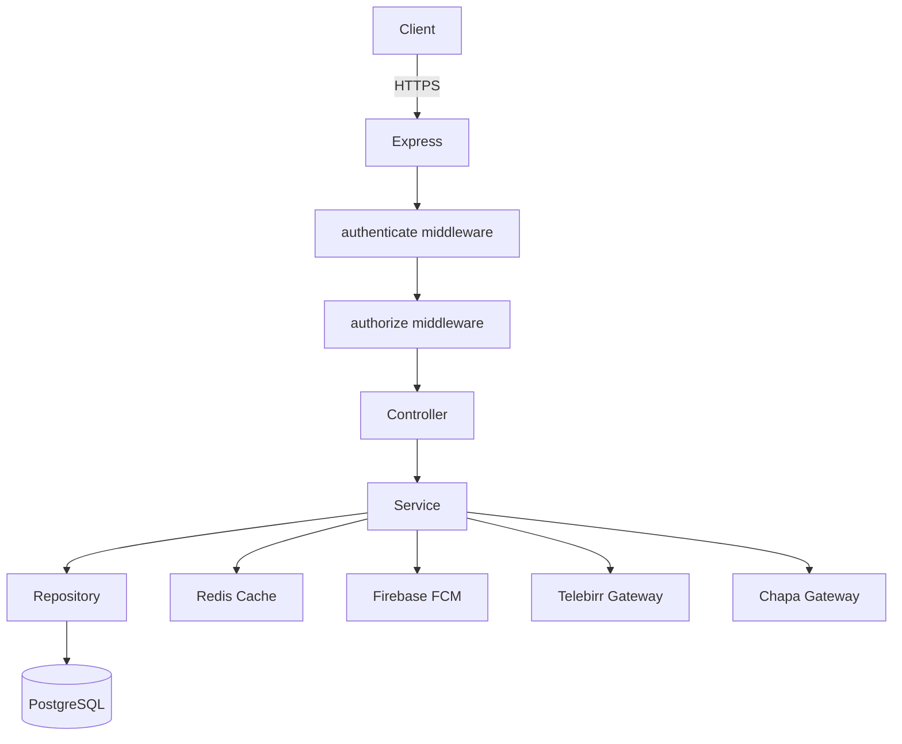
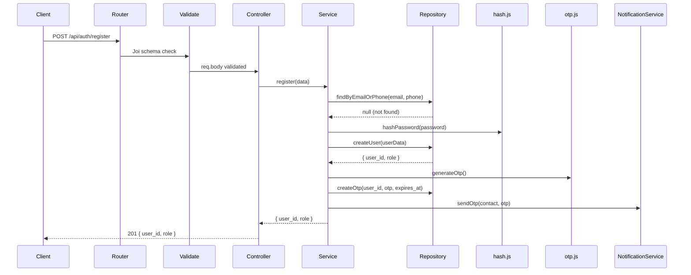
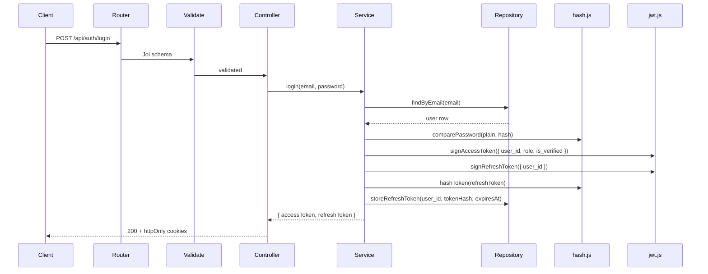

# Design Document: FarmConnect Backend

## Overview

FarmConnect is a RESTful API backend for a digital agricultural marketplace. It connects farmers, buyers, transporters, and administrators through a modular Node.js/Express application backed by PostgreSQL and Redis. The system handles authentication, product management, order processing, payment integration (Telebirr, Chapa), analytics, notifications, and transport logistics.

The design prioritizes:
- Clear separation of concerns via layered architecture
- Security-first approach (JWT, RBAC, parameterized queries, rate limiting)
- Horizontal scalability (stateless JWT + Redis)
- Immediate implementability of the auth module

---

## Architecture

### Layered Request Flow

```
HTTP Request
    │
    ▼
Router (express.Router)
    │
    ▼
Validation Middleware (Joi schema)
    │
    ▼
Auth Middleware (authenticate + authorize)
    │
    ▼
Controller (req/res handling, delegates to service)
    │
    ▼
Service (business logic, orchestration)
    │
    ▼
Repository (parameterized SQL via node-postgres)
    │
    ▼
PostgreSQL / Redis
```

### Directory Structure

```
src/
├── app.js                        # Express app setup, middleware registration
├── config/
│   ├── db.js                     # pg Pool setup
│   ├── redis.js                  # ioredis client
│   └── env.js                    # Validated env vars
├── middlewares/
│   ├── authenticate.js           # JWT verification
│   ├── authorize.js              # RBAC role check
│   ├── validate.js               # Joi schema validation
│   ├── errorHandler.js           # Centralized error handler
│   ├── rateLimiter.js            # express-rate-limit configs
│   └── requestId.js              # Attach UUID to req
├── Utils/
│   ├── AppError.js               # Custom error class
│   ├── jwt.js                    # signToken, verifyToken helpers
│   ├── hash.js                   # bcrypt helpers
│   ├── otp.js                    # OTP generation
│   ├── cache.js                  # Redis get/set/del helpers
│   └── logger.js                 # Structured logger
└── modules/
    ├── auth/
    ├── user/
    ├── product/
    ├── order/
    ├── payment/
    ├── transport/
    ├── notification/
    └── analytics/
```

### Mermaid Architecture Diagram



---

## Components and Interfaces

### Shared Middleware

#### `requestId.js`
Attaches a `uuid v4` as `req.id` and sets `X-Request-Id` response header. Runs first in the middleware stack.

#### `authenticate.js`
- Reads token from `Authorization: Bearer <token>` header or `access_token` httpOnly cookie
- Calls `jwt.verifyToken(token)`
- Attaches `{ user_id, role, is_verified }` to `req.user`
- Throws `401` if token missing, expired, or invalid
- Throws `403` if `req.user.is_verified === false`

#### `authorize.js`
```js
// Usage: authorize('admin', 'farmer')
const authorize = (...roles) => (req, res, next) => {
  if (!roles.includes(req.user.role)) throw new AppError('Forbidden', 403);
  next();
};
```

#### `validate.js`
```js
// Usage: validate(schema) — schema is a Joi object
const validate = (schema) => (req, res, next) => {
  const { error } = schema.validate(req.body, { abortEarly: false });
  if (error) throw new AppError(error.details.map(d => d.message).join(', '), 400);
  next();
};
```

#### `errorHandler.js`
Central error handler — last middleware registered in `app.js`.
```js
(err, req, res, next) => {
  const status = err.statusCode || 500;
  const message = status < 500 ? err.message : 'Internal Server Error';
  res.status(status).json({
    status: 'error',
    message,
    requestId: req.id,
    // stack only in development
  });
}
```

#### `rateLimiter.js`
Two configs exported:
- `authLimiter`: 100 req / 15 min per IP (applied to `/api/auth/*`)
- `apiLimiter`: 1000 req / 15 min per authenticated user (applied globally to `/api/*`)

### Utility Modules

#### `AppError.js`
```js
class AppError extends Error {
  constructor(message, statusCode) {
    super(message);
    this.statusCode = statusCode;
    this.isOperational = true;
  }
}
```

#### `jwt.js`
```js
signAccessToken(payload)   // signs with ACCESS_TOKEN_SECRET, 15m expiry
signRefreshToken(payload)  // signs with REFRESH_TOKEN_SECRET, 7d expiry
verifyToken(token, secret) // returns decoded payload or throws
```

#### `hash.js`
```js
hashPassword(plain)        // bcrypt.hash(plain, 10)
comparePassword(plain, hash) // bcrypt.compare
```

#### `otp.js`
```js
generateOtp()              // returns 6-digit numeric string
```

#### `cache.js`
```js
get(key)                   // redis.get(key), JSON.parse
set(key, value, ttlSeconds) // redis.set(key, JSON.stringify(value), 'EX', ttl)
del(key)                   // redis.del(key)
delByPattern(pattern)      // redis.keys(pattern) then del each
```

---

## Database Schema

### `users`
```sql
CREATE TABLE users (
  user_id       UUID PRIMARY KEY DEFAULT gen_random_uuid(),
  name          VARCHAR(100) NOT NULL,
  email         VARCHAR(255) UNIQUE NOT NULL,
  phone         VARCHAR(20) UNIQUE NOT NULL,
  password_hash TEXT NOT NULL,
  role          VARCHAR(20) NOT NULL CHECK (role IN ('farmer','buyer','admin','transporter')),
  is_verified   BOOLEAN NOT NULL DEFAULT FALSE,
  is_active     BOOLEAN NOT NULL DEFAULT TRUE,
  fcm_token     TEXT,
  location      VARCHAR(255),
  created_at    TIMESTAMPTZ NOT NULL DEFAULT NOW(),
  updated_at    TIMESTAMPTZ NOT NULL DEFAULT NOW()
);
CREATE INDEX idx_users_email ON users(email);
CREATE INDEX idx_users_phone ON users(phone);
CREATE INDEX idx_users_role  ON users(role);
```

### `refresh_tokens`
```sql
CREATE TABLE refresh_tokens (
  id            UUID PRIMARY KEY DEFAULT gen_random_uuid(),
  user_id       UUID NOT NULL REFERENCES users(user_id) ON DELETE CASCADE,
  token_hash    TEXT NOT NULL UNIQUE,
  expires_at    TIMESTAMPTZ NOT NULL,
  created_at    TIMESTAMPTZ NOT NULL DEFAULT NOW()
);
CREATE INDEX idx_refresh_tokens_user_id ON refresh_tokens(user_id);
```

### `otps`
```sql
CREATE TABLE otps (
  id          UUID PRIMARY KEY DEFAULT gen_random_uuid(),
  user_id     UUID NOT NULL REFERENCES users(user_id) ON DELETE CASCADE,
  otp_code    VARCHAR(6) NOT NULL,
  expires_at  TIMESTAMPTZ NOT NULL,
  used        BOOLEAN NOT NULL DEFAULT FALSE,
  created_at  TIMESTAMPTZ NOT NULL DEFAULT NOW()
);
CREATE INDEX idx_otps_user_id ON otps(user_id);
```

### `products`
```sql
CREATE TABLE products (
  product_id    UUID PRIMARY KEY DEFAULT gen_random_uuid(),
  farmer_id     UUID NOT NULL REFERENCES users(user_id),
  title         VARCHAR(255) NOT NULL,
  description   TEXT,
  price         NUMERIC(12,2) NOT NULL CHECK (price >= 0),
  quantity      INTEGER NOT NULL DEFAULT 0 CHECK (quantity >= 0),
  category      VARCHAR(100) NOT NULL,
  location      VARCHAR(255),
  status        VARCHAR(20) NOT NULL DEFAULT 'active'
                  CHECK (status IN ('active','out_of_stock','deleted')),
  created_at    TIMESTAMPTZ NOT NULL DEFAULT NOW(),
  updated_at    TIMESTAMPTZ NOT NULL DEFAULT NOW()
);
CREATE INDEX idx_products_category ON products(category);
CREATE INDEX idx_products_price    ON products(price);
CREATE INDEX idx_products_status   ON products(status);
CREATE INDEX idx_products_farmer   ON products(farmer_id);
```

### `orders`
```sql
CREATE TABLE orders (
  order_id      UUID PRIMARY KEY DEFAULT gen_random_uuid(),
  buyer_id      UUID NOT NULL REFERENCES users(user_id),
  product_id    UUID NOT NULL REFERENCES products(product_id),
  quantity      INTEGER NOT NULL CHECK (quantity > 0),
  total_amount  NUMERIC(12,2) NOT NULL,
  status        VARCHAR(20) NOT NULL DEFAULT 'Pending'
                  CHECK (status IN ('Pending','Confirmed','Processing','Shipped','Delivered','Failed','Cancelled')),
  created_at    TIMESTAMPTZ NOT NULL DEFAULT NOW(),
  updated_at    TIMESTAMPTZ NOT NULL DEFAULT NOW()
);
CREATE INDEX idx_orders_buyer   ON orders(buyer_id);
CREATE INDEX idx_orders_product ON orders(product_id);
CREATE INDEX idx_orders_status  ON orders(status);
```

### `payments`
```sql
CREATE TABLE payments (
  payment_id      UUID PRIMARY KEY DEFAULT gen_random_uuid(),
  order_id        UUID NOT NULL REFERENCES orders(order_id),
  buyer_id        UUID NOT NULL REFERENCES users(user_id),
  payment_method  VARCHAR(20) NOT NULL CHECK (payment_method IN ('telebirr','chapa')),
  payment_status  VARCHAR(20) NOT NULL DEFAULT 'pending'
                    CHECK (payment_status IN ('pending','success','failed')),
  transaction_ref TEXT,
  gateway_ref     TEXT,
  amount          NUMERIC(12,2) NOT NULL,
  created_at      TIMESTAMPTZ NOT NULL DEFAULT NOW(),
  updated_at      TIMESTAMPTZ NOT NULL DEFAULT NOW()
);
CREATE INDEX idx_payments_order  ON payments(order_id);
CREATE INDEX idx_payments_buyer  ON payments(buyer_id);
```

### `notifications`
```sql
CREATE TABLE notifications (
  notification_id UUID PRIMARY KEY DEFAULT gen_random_uuid(),
  user_id         UUID NOT NULL REFERENCES users(user_id) ON DELETE CASCADE,
  type            VARCHAR(50) NOT NULL,
  message         TEXT NOT NULL,
  is_read         BOOLEAN NOT NULL DEFAULT FALSE,
  created_at      TIMESTAMPTZ NOT NULL DEFAULT NOW()
);
CREATE INDEX idx_notifications_user    ON notifications(user_id);
CREATE INDEX idx_notifications_created ON notifications(created_at DESC);
```

### `delivery_assignments`
```sql
CREATE TABLE delivery_assignments (
  assignment_id   UUID PRIMARY KEY DEFAULT gen_random_uuid(),
  order_id        UUID NOT NULL REFERENCES orders(order_id),
  transporter_id  UUID NOT NULL REFERENCES users(user_id),
  status          VARCHAR(20) NOT NULL DEFAULT 'Assigned'
                    CHECK (status IN ('Assigned','PickedUp','InTransit','Delivered','Failed')),
  created_at      TIMESTAMPTZ NOT NULL DEFAULT NOW(),
  updated_at      TIMESTAMPTZ NOT NULL DEFAULT NOW()
);
CREATE INDEX idx_delivery_transporter ON delivery_assignments(transporter_id);
CREATE INDEX idx_delivery_order       ON delivery_assignments(order_id);
```

### `market_price_history`
```sql
CREATE TABLE market_price_history (
  id          UUID PRIMARY KEY DEFAULT gen_random_uuid(),
  category    VARCHAR(100) NOT NULL,
  avg_price   NUMERIC(12,2) NOT NULL,
  min_price   NUMERIC(12,2) NOT NULL,
  max_price   NUMERIC(12,2) NOT NULL,
  recorded_at DATE NOT NULL DEFAULT CURRENT_DATE
);
CREATE INDEX idx_mph_category_date ON market_price_history(category, recorded_at);
```

### `search_history`
```sql
CREATE TABLE search_history (
  id          UUID PRIMARY KEY DEFAULT gen_random_uuid(),
  user_id     UUID NOT NULL REFERENCES users(user_id) ON DELETE CASCADE,
  query       TEXT NOT NULL,
  category    VARCHAR(100),
  created_at  TIMESTAMPTZ NOT NULL DEFAULT NOW()
);
CREATE INDEX idx_search_history_user ON search_history(user_id);
```

---

## Module-by-Module API Design

### Auth Module (`/api/auth`)

| Method | Path | Auth | Description |
|--------|------|------|-------------|
| POST | `/register` | None | Register new user |
| POST | `/login` | None | Login, get tokens |
| POST | `/refresh` | None | Refresh access token |
| POST | `/logout` | Bearer | Invalidate refresh token |
| POST | `/verify-otp` | None | Verify OTP |
| POST | `/resend-otp` | None | Resend OTP |

#### POST `/api/auth/register`
Request:
```json
{ "name": "Abebe", "email": "a@b.com", "phone": "+251911000000", "password": "Secret123!", "role": "farmer" }
```
Response `201`:
```json
{ "user_id": "uuid", "role": "farmer", "message": "OTP sent for verification" }
```

#### POST `/api/auth/login`
Request: `{ "email": "a@b.com", "password": "Secret123!" }`
Response `200`:
```json
{ "accessToken": "...", "refreshToken": "..." }
```
Tokens also set as httpOnly cookies (`access_token`, `refresh_token`).

#### POST `/api/auth/refresh`
Request: `{ "refreshToken": "..." }` or cookie
Response `200`: `{ "accessToken": "..." }`

#### POST `/api/auth/logout`
Request: `{ "refreshToken": "..." }` or cookie
Response `200`: `{ "message": "Logged out" }`

#### POST `/api/auth/verify-otp`
Request: `{ "user_id": "uuid", "otp": "123456" }`
Response `200`: `{ "message": "Account verified" }`

#### POST `/api/auth/resend-otp`
Request: `{ "user_id": "uuid" }`
Response `200`: `{ "message": "OTP resent" }`

---

### User Module (`/api/users`)

| Method | Path | Auth | Roles |
|--------|------|------|-------|
| GET | `/me` | Bearer | any |
| PATCH | `/me` | Bearer | any |
| GET | `/:id` | Bearer | admin |
| GET | `/` | Bearer | admin |
| DELETE | `/:id` | Bearer | admin |

---

### Product Module (`/api/products`)

| Method | Path | Auth | Roles |
|--------|------|------|-------|
| GET | `/` | Optional | any |
| POST | `/` | Bearer | farmer |
| PATCH | `/:id` | Bearer | farmer |
| DELETE | `/:id` | Bearer | farmer, admin |

Query params for GET `/`: `search`, `category`, `minPrice`, `maxPrice`, `location`, `page`, `limit`

---

### Order Module (`/api/orders`)

| Method | Path | Auth | Roles |
|--------|------|------|-------|
| POST | `/` | Bearer | buyer |
| GET | `/` | Bearer | buyer, farmer, admin |
| GET | `/:id` | Bearer | buyer, farmer, admin |
| PATCH | `/:id/status` | Bearer | farmer, admin |

Valid status transitions:
```
Pending → Confirmed → Processing → Shipped → Delivered
Pending → Cancelled
Pending → Failed
```

---

### Payment Module (`/api/payments`)

| Method | Path | Auth | Roles |
|--------|------|------|-------|
| POST | `/initiate` | Bearer | buyer |
| POST | `/webhook/:gateway` | None (signature verified) | — |
| GET | `/:payment_id` | Bearer | buyer, admin |

---

### Analytics Module (`/api/analytics`)

| Method | Path | Auth | Roles |
|--------|------|------|-------|
| GET | `/market-prices` | Bearer | any |
| GET | `/market-prices/history` | Bearer | any |
| GET | `/dashboard` | Bearer | admin, farmer, buyer |

---

### Notification Module (`/api/notifications`)

| Method | Path | Auth | Roles |
|--------|------|------|-------|
| GET | `/` | Bearer | any |
| PATCH | `/:id/read` | Bearer | any |
| PATCH | `/read-all` | Bearer | any |

---

### Transport Module (`/api/transport`)

| Method | Path | Auth | Roles |
|--------|------|------|-------|
| POST | `/assign` | Bearer | admin |
| PATCH | `/:assignment_id/status` | Bearer | transporter |
| GET | `/my-deliveries` | Bearer | transporter |

---

## Auth Module — Full Detail

### Registration Flow



### Login Flow



### Token Refresh Flow

1. Client sends refresh token (cookie or body)
2. Service hashes the incoming token, queries `refresh_tokens` by `token_hash`
3. Checks `expires_at > NOW()`
4. Issues new access token
5. Returns `{ accessToken }`

### Logout Flow

1. Client sends refresh token
2. Service hashes it, deletes matching row from `refresh_tokens`
3. Clears cookies, returns `200`

### OTP Verification Flow

1. Client sends `{ user_id, otp }`
2. Repository fetches latest unused OTP for `user_id`
3. Check `expires_at > NOW()` — else `410 Gone`
4. Check `otp_code === otp` — else `400`
5. Mark OTP `used = true`, set `users.is_verified = true`
6. Return `200`

### JWT Payload Structure

```json
// Access token payload
{ "user_id": "uuid", "role": "farmer", "is_verified": true, "iat": 0, "exp": 0 }

// Refresh token payload
{ "user_id": "uuid", "iat": 0, "exp": 0 }
```

### Refresh Token Storage Strategy

Refresh tokens are stored **hashed** (SHA-256) in the `refresh_tokens` table. The raw token is only ever sent to the client. This means a database breach does not expose usable refresh tokens.

```js
// In jwt.js
const crypto = require('crypto');
const hashToken = (token) => crypto.createHash('sha256').update(token).digest('hex');
```

### Auth Middleware Chain (Protected Routes)

```
authenticate → (optionally) authorize(...roles) → controller
```

`authenticate` sets `req.user`. `authorize` checks `req.user.role`. Both are composable:

```js
router.get('/me', authenticate, getMe);
router.post('/products', authenticate, authorize('farmer'), createProduct);
router.get('/admin/users', authenticate, authorize('admin'), listUsers);
```

---

## Redis Cache Key Naming Conventions

All keys follow the pattern: `farmconnect:{module}:{identifier}:{params_hash}`

| Cache Purpose | Key Pattern | TTL |
|---|---|---|
| Product listing page | `farmconnect:products:list:{md5(queryParams)}` | 5 min |
| Single product | `farmconnect:products:{product_id}` | 10 min |
| Market price current | `farmconnect:analytics:market:{category}` | 10 min |
| Market price history | `farmconnect:analytics:history:{category}:{from}:{to}` | 10 min |
| User recommendations | `farmconnect:recommendations:{user_id}` | 30 min |

Cache invalidation on write:
- Product create/update/delete → `del farmconnect:products:list:*` (pattern delete) + `del farmconnect:products:{product_id}`
- Price change → `del farmconnect:analytics:market:{category}`

---

## Environment Variables

```env
# Server
NODE_ENV=development
PORT=3000

# PostgreSQL
DB_HOST=localhost
DB_PORT=5432
DB_NAME=farmconnect
DB_USER=postgres
DB_PASSWORD=secret
DB_POOL_MAX=10

# Redis
REDIS_HOST=localhost
REDIS_PORT=6379
REDIS_PASSWORD=

# JWT
ACCESS_TOKEN_SECRET=<32+ char random string>
REFRESH_TOKEN_SECRET=<32+ char random string>
ACCESS_TOKEN_EXPIRY=15m
REFRESH_TOKEN_EXPIRY=7d

# Bcrypt
BCRYPT_ROUNDS=10

# Telebirr
TELEBIRR_APP_ID=
TELEBIRR_APP_KEY=
TELEBIRR_SHORT_CODE=
TELEBIRR_PUBLIC_KEY=
TELEBIRR_BASE_URL=

# Chapa
CHAPA_SECRET_KEY=
CHAPA_BASE_URL=https://api.chapa.co/v1
CHAPA_WEBHOOK_SECRET=

# Firebase FCM
FCM_PROJECT_ID=
FCM_PRIVATE_KEY=
FCM_CLIENT_EMAIL=

# App
APP_BASE_URL=https://api.farmconnect.et
CORS_ORIGIN=https://farmconnect.et
```

---

## Error Handling

### AppError Usage

All operational errors are thrown as `AppError` instances from service/repository layers. The central `errorHandler` middleware catches them.

```
400 Bad Request      — validation failures, bad OTP
401 Unauthorized     — missing/invalid/expired JWT
403 Forbidden        — wrong role, unverified account
404 Not Found        — resource not found
409 Conflict         — duplicate email/phone, insufficient stock
410 Gone             — expired OTP
422 Unprocessable    — invalid status transition
500 Internal         — unexpected errors (message hidden in production)
```

### Unhandled Rejections / Exceptions

`app.js` registers `process.on('unhandledRejection')` and `process.on('uncaughtException')` to log and gracefully shut down.

### Slow Query Logging

Repository wraps queries:
```js
const start = Date.now();
const result = await pool.query(sql, params);
const duration = Date.now() - start;
if (duration > 500) logger.warn({ queryId, duration }, 'Slow query detected');
```

---

## Testing Strategy

### Dual Testing Approach

Both unit/integration tests and property-based tests are required. They are complementary:
- Unit/integration tests: verify specific examples, error conditions, integration points
- Property-based tests: verify universal invariants across randomized inputs

### Unit / Integration Tests

Framework: **Jest** + **supertest** for HTTP-level integration tests.

Focus areas:
- Auth flows: register, login, refresh, logout, OTP verify
- RBAC: correct 403 responses for wrong roles
- Validation: 400 responses for missing/invalid fields
- Order status transitions: valid and invalid transitions
- Payment webhook: valid and invalid signatures

### Property-Based Tests

Framework: **fast-check** (TypeScript-compatible, works with Jest).

Configuration: minimum **100 runs** per property test.

Tag format in test comments: `Feature: farmconnect-backend, Property N: <property_text>`

Each correctness property below maps to exactly one property-based test.

---

## Correctness Properties

*A property is a characteristic or behavior that should hold true across all valid executions of a system — essentially, a formal statement about what the system should do. Properties serve as the bridge between human-readable specifications and machine-verifiable correctness guarantees.*

### Property 1: Password hashing is irreversible and consistent

*For any* plaintext password, hashing it and then comparing the hash against the original plaintext should return true, and the stored hash should never equal the plaintext.

**Validates: Requirements 1.4**

### Property 2: Duplicate email/phone registration is rejected

*For any* user registration, if a user with the same email or phone already exists in the system, the registration attempt should be rejected with a conflict error and the user count should remain unchanged.

**Validates: Requirements 1.2**

### Property 3: JWT access token round trip

*For any* valid user payload, signing it into an access token and then verifying that token should produce an equivalent payload with matching `user_id` and `role`.

**Validates: Requirements 2.1, 2.4, 4.4**

### Property 4: Expired tokens are rejected

*For any* token signed with a past expiry, verifying it should always throw an error — regardless of the payload contents.

**Validates: Requirements 2.6, 4.4**

### Property 5: OTP expiry enforcement

*For any* OTP record whose `expires_at` is in the past, attempting to verify it should return a `410 Gone` error and the user's `is_verified` status should remain unchanged.

**Validates: Requirements 3.2**

### Property 6: OTP resend invalidates previous OTP

*For any* user with an existing unused OTP, calling resend-otp should result in the previous OTP being unusable and a new OTP being the only valid one.

**Validates: Requirements 3.4**

### Property 7: RBAC role enforcement

*For any* protected endpoint that requires role R, a request authenticated with any role other than R should receive a `403 Forbidden` response.

**Validates: Requirements 4.2, 4.3**

### Property 8: Unverified users are blocked from protected endpoints

*For any* authenticated request where `is_verified = false`, accessing any protected endpoint should return `403 Forbidden`.

**Validates: Requirements 3.5**

### Property 9: Order creation decrements product quantity atomically

*For any* product with quantity Q and an order for quantity N (where N ≤ Q), after the order is created the product's quantity should equal Q - N, and the order's `total_amount` should equal N × product price.

**Validates: Requirements 8.1, 8.3**

### Property 10: Insufficient stock orders are rejected

*For any* product with quantity Q and an order request for quantity N where N > Q, the order should be rejected with a conflict error and the product quantity should remain Q.

**Validates: Requirements 8.2**

### Property 11: Invalid order status transitions are rejected

*For any* order in status S, attempting a transition to a status not reachable from S should return `422 Unprocessable Entity` and the order status should remain S.

**Validates: Requirements 8.5**

### Property 12: Product listing cache consistency

*For any* set of query parameters, if a product listing is cached and then a product matching those parameters is created/updated/deleted, the cache entry for that query should be invalidated so subsequent reads reflect the change.

**Validates: Requirements 6.6, 7.6**

### Property 13: Parameterized queries prevent SQL injection

*For any* user-supplied string input (including SQL metacharacters like `'`, `--`, `;`), passing it through the repository layer should not alter query structure or return unintended rows.

**Validates: Requirements 13.6**

### Property 14: Paginated list endpoints are stable

*For any* dataset of N items and page size L, the union of all pages should contain exactly the same items as a full unpaginated query, with no duplicates and no omissions.

**Validates: Requirements 5.5, 7.1**

### Property 15: Notification creation on order status change

*For any* order status transition, a notification record should be created for both the buyer and the relevant farmer, with a non-empty message and the correct `user_id`.

**Validates: Requirements 8.8, 11.1**
