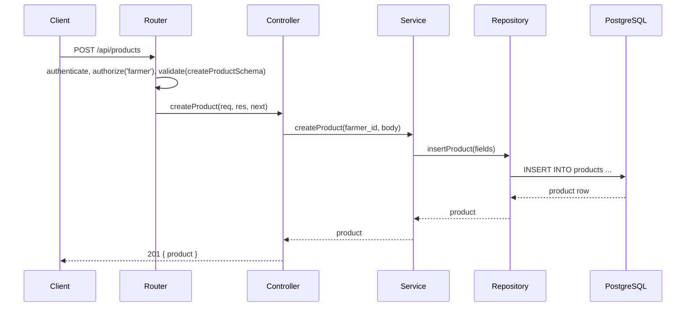

# Design Document: Product Module

## Overview

The Product Module is an Express sub-application mounted at `/api/products` that handles all product listing and management operations for the FarmConnect platform. It follows the same 5-file structure (`controller.js`, `service.js`, `repository.js`, `router.js`, `validation.js`) established by the auth and user modules.

Farmers can create, update, and soft-delete their own listings. Any authenticated user can browse active products with optional filters or fetch a single product by ID. Admins can set any product's status directly. All routes require a valid, verified JWT.

## Architecture

The module follows the same layered architecture used throughout FarmConnect:

```
HTTP Request
    │
    ▼
router.js          ← Express Router, middleware wiring, route ordering
    │
    ▼
controller.js      ← Thin HTTP handlers, delegates to service, forwards errors via next(e)
    │
    ▼
service.js         ← Business logic, ownership checks, AppError throws
    │
    ▼
repository.js      ← Raw PostgreSQL queries via query() from config/db
    │
    ▼
PostgreSQL (products table)
```

Validation is handled by Joi schemas in `validation.js`, applied via the shared `validate` middleware before the controller is reached. UUID param validation is done inline in the router (same pattern as user module).



## Components and Interfaces

### router.js

Mounts all routes under `/api/products`. Route declaration order is critical — `/my` and `/:id/status` must appear before `/:id`.

```
router.use(authenticate)

POST   /                  authorize('farmer'), validate(createProductSchema),  createProduct
GET    /my                authorize('farmer'),                                  getMyProducts
GET    /                  (no extra auth),                                      listProducts
GET    /:id               validateUuidParam,                                    getProductById
PATCH  /:id/status        authorize('admin'),  validateUuidParam, validate(updateStatusSchema), updateProductStatus
PATCH  /:id               authorize('farmer'), validateUuidParam, validate(updateProductSchema), updateProduct
DELETE /:id               authorize('farmer'), validateUuidParam,               deleteProduct
```

The `validateUuidParam` helper is defined inline in the router (same pattern as user module):
```js
const validateUuidParam = (req, res, next) => {
  const { error } = uuidParamSchema.validate(req.params);
  if (error) return next(new AppError(error.details.map(d => d.message).join(', '), 400));
  next();
};
```

### validation.js

Joi schemas for request body and query validation:

- `createProductSchema` — required: `title` (3–255), `price` (≥0), `quantity` (integer ≥0), `category` (2–100); optional: `description` (max 2000), `location` (max 255)
- `updateProductSchema` — same field rules as create, all optional, `.or(...)` requiring at least one updatable field
- `updateStatusSchema` — required: `status` one of `active`, `out_of_stock`, `deleted`
- `listProductsQuerySchema` — optional: `category` (string), `location` (string), `min_price` (number ≥0), `max_price` (number ≥0)
- `uuidParamSchema` — `id` as UUID string (reused from user module pattern)

Query parameter validation for `GET /api/products` is applied inline in the router using `listProductsQuerySchema` against `req.query`.

### controller.js

Thin async handlers, each following the same pattern as the user module:

```js
const createProduct = async (req, res, next) => {
  try {
    const product = await productService.createProduct(req.user.user_id, req.body);
    res.status(201).json(product);
  } catch (e) { next(e); }
};
```

Handlers: `createProduct`, `getMyProducts`, `listProducts`, `getProductById`, `updateProduct`, `deleteProduct`, `updateProductStatus`.

### service.js

Business logic layer. Throws `AppError` for all expected error conditions:

| Function | Logic |
|---|---|
| `createProduct(farmer_id, body)` | Calls `repo.insertProduct`, returns full product row |
| `getMyProducts(farmer_id)` | Calls `repo.findByFarmer`, returns array |
| `listProducts(filters)` | Calls `repo.findActive(filters)`, returns array |
| `getProductById(id)` | Calls `repo.findById`; throws 404 if not found or deleted |
| `updateProduct(id, farmer_id, body)` | Fetches product; throws 404/403/400 as needed; calls `repo.updateProduct` |
| `deleteProduct(id, farmer_id)` | Fetches product; throws 404/403/400 as needed; calls `repo.softDelete` |
| `updateProductStatus(id, status)` | Fetches product; throws 404 if not found; calls `repo.updateStatus` |

### repository.js

Raw SQL via `query()` from `../../config/db`. Dynamic `SET` clause construction for updates mirrors the user repository pattern.

| Function | SQL |
|---|---|
| `insertProduct(fields)` | `INSERT INTO products (...) VALUES (...) RETURNING *` |
| `findByFarmer(farmer_id)` | `SELECT * FROM products WHERE farmer_id = $1 ORDER BY created_at DESC` |
| `findActive(filters)` | Dynamic `WHERE status = 'active'` + optional filter clauses, `ORDER BY created_at DESC` |
| `findById(id)` | `SELECT * FROM products WHERE product_id = $1` |
| `updateProduct(id, fields)` | Dynamic `SET` clause, `updated_at = NOW()`, `RETURNING *` |
| `softDelete(id)` | `UPDATE products SET status = 'deleted', updated_at = NOW() WHERE product_id = $1` |
| `updateStatus(id, status)` | `UPDATE products SET status = $2, updated_at = NOW() WHERE product_id = $1 RETURNING *` |

Dynamic filter building in `findActive` uses parameterized queries to prevent SQL injection:

```js
async function findActive(filters = {}) {
  const conditions = ["status = 'active'"];
  const values = [];

  if (filters.category) {
    values.push(filters.category);
    conditions.push(`LOWER(category) = LOWER($${values.length})`);
  }
  if (filters.location) {
    values.push(`%${filters.location}%`);
    conditions.push(`LOWER(location) LIKE LOWER($${values.length})`);
  }
  if (filters.min_price !== undefined) {
    values.push(filters.min_price);
    conditions.push(`price >= $${values.length}`);
  }
  if (filters.max_price !== undefined) {
    values.push(filters.max_price);
    conditions.push(`price <= $${values.length}`);
  }

  const sql = `SELECT * FROM products WHERE ${conditions.join(' AND ')} ORDER BY created_at DESC`;
  const result = await query(sql, values);
  return result.rows;
}
```

## Data Models

### Product (database row)

```
product_id    UUID        PK, gen_random_uuid()
farmer_id     UUID        FK → users(user_id), NOT NULL
title         VARCHAR(255) NOT NULL
description   TEXT        nullable
price         NUMERIC(12,2) NOT NULL, CHECK >= 0
quantity      INTEGER     NOT NULL DEFAULT 0, CHECK >= 0
category      VARCHAR(100) NOT NULL
location      VARCHAR(255) nullable
status        VARCHAR(20) NOT NULL DEFAULT 'active'
              CHECK IN ('active', 'out_of_stock', 'deleted')
created_at    TIMESTAMPTZ NOT NULL DEFAULT NOW()
updated_at    TIMESTAMPTZ NOT NULL DEFAULT NOW()
```

### Request Bodies

**Create Product** (`POST /api/products`):
```json
{
  "title": "Fresh Tomatoes",
  "description": "Organic, vine-ripened",
  "price": 12.50,
  "quantity": 100,
  "category": "Vegetables",
  "location": "Addis Ababa"
}
```

**Update Product** (`PATCH /api/products/:id`):
```json
{ "price": 10.00, "quantity": 80 }
```

**Update Status** (`PATCH /api/products/:id/status`):
```json
{ "status": "out_of_stock" }
```

### Response Shape

All product endpoints return the full product row as returned by `RETURNING *` from PostgreSQL. No field stripping is needed (unlike users where `password_hash` is removed).

### Query Parameters (`GET /api/products`)

| Param | Type | Constraint |
|---|---|---|
| `category` | string | case-insensitive exact match |
| `location` | string | case-insensitive partial match |
| `min_price` | number | ≥ 0 |
| `max_price` | number | ≥ 0 |

## Correctness Properties

*A property is a characteristic or behavior that should hold true across all valid executions of a system — essentially, a formal statement about what the system should do. Properties serve as the bridge between human-readable specifications and machine-verifiable correctness guarantees.*

### Property 1: Create product round-trip

*For any* valid product creation body submitted by a farmer, the response should be HTTP 201 and the returned product should contain all submitted fields plus `product_id`, `farmer_id` equal to the requesting farmer's ID, `status` equal to `active`, and timestamps.

**Validates: Requirements 1.1, 1.10, 1.11**

---

### Property 2: Role guards reject unauthorized roles

*For any* endpoint restricted to a specific role (`farmer` or `admin`), a request made by an authenticated user with a different role should receive HTTP 403.

**Validates: Requirements 1.2, 2.2, 3.2, 4.2, 7.2, 8.4, 8.5**

---

### Property 3: Invalid input fields are rejected with 400

*For any* product creation or update request where a field violates its validation rule (title outside 3–255 chars, price < 0, quantity < 0, category outside 2–100 chars, description > 2000 chars, location > 255 chars), the response should be HTTP 400.

**Validates: Requirements 1.3, 1.4, 1.5, 1.6, 1.7, 1.8, 1.9, 2.8**

---

### Property 4: Invalid UUID param returns 400

*For any* route that accepts `:id`, sending a value that is not a valid UUID should return HTTP 400.

**Validates: Requirements 2.3, 3.3, 6.2, 7.3**

---

### Property 5: Non-existent product ID returns 404

*For any* route that looks up a product by `:id`, if no product row exists for that UUID, the response should be HTTP 404 with message `"Product not found"`.

**Validates: Requirements 2.4, 3.4, 6.3, 7.6**

---

### Property 6: Ownership check returns 403

*For any* farmer-owned operation (`PATCH /:id`, `DELETE /:id`), if the requesting farmer's `user_id` does not match the product's `farmer_id`, the response should be HTTP 403 with message `"Forbidden"`.

**Validates: Requirements 2.5, 3.5**

---

### Property 7: Partial update preserves unmodified fields

*For any* product and any non-empty subset of updatable fields, after a successful `PATCH`, only the supplied fields should change; all other fields should retain their previous values, and `updated_at` should be greater than its previous value.

**Validates: Requirements 2.6, 2.9**

---

### Property 8: Soft-delete sets status to deleted without removing the row

*For any* active product, after a successful `DELETE /api/products/:id`, the product row should still exist in the database with `status = 'deleted'` and `updated_at` updated.

**Validates: Requirements 3.6**

---

### Property 9: GET /my returns all farmer products regardless of status

*For any* farmer with products in various statuses (active, out_of_stock, deleted), `GET /api/products/my` should return all of them ordered by `created_at DESC`.

**Validates: Requirements 4.1, 4.3**

---

### Property 10: List active products only returns active products

*For any* set of products with mixed statuses, `GET /api/products` should return only products with `status = 'active'`, ordered by `created_at DESC`.

**Validates: Requirements 5.1, 5.2, 5.3**

---

### Property 11: Filters narrow results correctly

*For any* active product set and any combination of filters (`category`, `location`, `min_price`, `max_price`), every product in the response must satisfy all applied filter conditions (case-insensitive category match, case-insensitive partial location match, price within bounds).

**Validates: Requirements 5.4, 5.5, 5.6, 5.7**

---

### Property 12: Invalid price filter values return 400

*For any* `GET /api/products` request where `min_price` or `max_price` is a negative number or non-numeric string, the response should be HTTP 400.

**Validates: Requirements 5.8**

---

### Property 13: Admin status update round-trip

*For any* existing product and any valid status value (`active`, `out_of_stock`, `deleted`), after a successful `PATCH /:id/status` by an admin, the returned product should have `status` equal to the submitted value and `updated_at` updated.

**Validates: Requirements 7.1, 7.7, 7.8**

---

### Property 14: Invalid status value returns 400

*For any* `PATCH /:id/status` request where `status` is not one of `active`, `out_of_stock`, `deleted`, the response should be HTTP 400.

**Validates: Requirements 7.5**

---

### Property 15: Unauthenticated requests return 401

*For any* route under `/api/products`, a request made without a JWT (or with an invalid/expired JWT) should return HTTP 401.

**Validates: Requirements 8.1, 8.2**

---

## Error Handling

All errors follow the existing platform pattern: the service throws `AppError(message, statusCode)`, the controller forwards it via `next(e)`, and the global `errorHandler` middleware formats the response.

| Scenario | Status | Message |
|---|---|---|
| No token / invalid token | 401 | `"No token provided"` / `"Invalid or expired token"` |
| Unverified account | 403 | `"Account not verified. Please verify your OTP."` |
| Wrong role | 403 | `"Forbidden"` |
| Validation failure | 400 | Joi error message(s) joined by `, ` |
| Invalid UUID param | 400 | Joi error message |
| Product not found | 404 | `"Product not found"` |
| Ownership mismatch | 403 | `"Forbidden"` |
| Update deleted product | 400 | `"Cannot update a deleted product"` |
| Delete already-deleted product | 400 | `"Product is already deleted"` |
| Invalid status value | 400 | Joi error message |

No try/catch is needed in the service for database errors — unexpected DB errors bubble up as unhandled exceptions and are caught by the global error handler, which returns 500.

## Testing Strategy

### Dual Testing Approach

Both unit tests and property-based tests are required. They are complementary:
- Unit tests cover specific examples, integration points, and edge cases
- Property tests verify universal correctness across many generated inputs

### Unit Tests

Focus on:
- Specific happy-path examples for each endpoint (create, read, update, delete, list, admin status)
- Edge cases: empty product list returns `[]`, deleting an already-deleted product, updating a deleted product, GET by ID on a deleted product
- Route ordering: `GET /my` resolves correctly and does not trigger UUID validation
- Unverified user token returns 403

### Property-Based Tests

Use **fast-check** (JavaScript property-based testing library).

Each property test must run a minimum of **100 iterations**.

Each test must include a comment tag in the format:
`// Feature: product-module, Property <N>: <property_text>`

| Property | Test Description |
|---|---|
| P1 | Generate random valid product bodies, POST as farmer, assert 201 + all fields present + status=active + farmer_id matches |
| P2 | Generate requests to role-restricted endpoints with random non-matching roles, assert 403 |
| P3 | Generate product bodies with each field set to an out-of-range value, assert 400 |
| P4 | Generate random non-UUID strings for `:id` param, assert 400 |
| P5 | Generate random UUIDs not in DB, assert 404 |
| P6 | Create product as farmer A, attempt PATCH/DELETE as farmer B, assert 403 |
| P7 | Create product, PATCH a random subset of fields, assert only those fields changed and updated_at increased |
| P8 | Create product, DELETE it, query DB directly, assert row exists with status=deleted |
| P9 | Create N products as farmer with mixed statuses, GET /my, assert all N returned in created_at DESC order |
| P10 | Create products with mixed statuses, GET /products, assert only active ones returned in created_at DESC order |
| P11 | Create products with random categories/locations/prices, apply each filter combination, assert all results satisfy the filter |
| P12 | Generate negative or non-numeric min_price/max_price values, assert 400 |
| P13 | For each valid status value, admin PATCH /:id/status, assert response status matches and updated_at increased |
| P14 | Generate arbitrary strings not in the valid status enum, assert 400 |
| P15 | Call each route without Authorization header, assert 401 |
