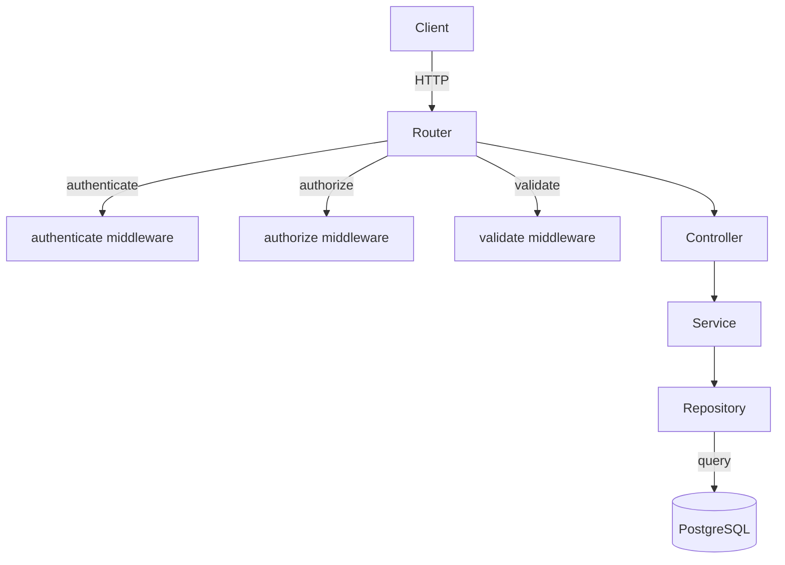

# Design Document: User Module

## Overview

The User Module is an Express sub-application mounted at `/api/users` in the FarmConnect platform. It provides two categories of functionality:

1. **Self-service profile management** — authenticated users can read their profile, update mutable fields, change their password, and deactivate their account.
2. **Admin user management** — admin users can list all users with optional filters, retrieve any user by UUID, and update a user's role or active status.

The module mirrors the auth module's 4-file structure: `repository.js`, `service.js`, `controller.js`, `router.js`, plus `validation.js`. It reuses the existing `authenticate` and `authorize` middlewares, the `validate` Joi middleware, `AppError`, `hashPassword`, and `comparePassword` utilities.

---

## Architecture

The module follows the same layered architecture as the auth module:

```
HTTP Request
    │
    ▼
router.js          ← wires authenticate, authorize, validate, controller
    │
    ▼
controller.js      ← extracts req data, calls service, returns JSON / next(e)
    │
    ▼
service.js         ← business logic, throws AppError on violations
    │
    ▼
repository.js      ← raw pg queries via query() from config/db
    │
    ▼
PostgreSQL (users table)
```



---

## Components and Interfaces

### router.js

Mounts all routes under `/api/users`. Applies `authenticate` globally to all routes, then `authorize('admin')` to admin-only routes, and `validate(schema)` where request body validation is needed.

```
GET    /me              → authenticate → getMe
PATCH  /me              → authenticate → validate(updateProfileSchema) → updateMe
PATCH  /me/password     → authenticate → validate(changePasswordSchema) → changePassword
DELETE /me              → authenticate → deleteMe

GET    /                → authenticate → authorize('admin') → listUsers
GET    /:id             → authenticate → authorize('admin') → getUserById
PATCH  /:id             → authenticate → authorize('admin') → validate(adminUpdateSchema) → adminUpdateUser
```

Note: `/me` routes must be declared before `/:id` to prevent Express matching "me" as a UUID param.

### controller.js

Each handler follows the auth module pattern:

```js
const handlerName = async (req, res, next) => {
  try {
    const result = await userService.someMethod(...);
    res.status(200).json(result);
  } catch (e) {
    next(e);
  }
};
```

- `getMe` — passes `req.user.user_id` to service, returns profile
- `updateMe` — passes `req.user.user_id` + `req.body` to service, returns updated profile
- `changePassword` — passes `req.user.user_id` + `req.body` to service, returns `{ message }`
- `deleteMe` — passes `req.user.user_id` to service, returns `{ message }`
- `listUsers` — passes `req.query` filters to service, returns array of profiles
- `getUserById` — passes `req.params.id` to service, returns profile
- `adminUpdateUser` — passes `req.params.id` + `req.body` to service, returns updated profile

### service.js

Business logic layer. All functions are `async` and throw `AppError` for expected error conditions.

| Function | Responsibility |
|---|---|
| `getProfile(user_id)` | Fetch user, throw 404 if not found, return profile (no password_hash) |
| `updateProfile(user_id, fields)` | Check phone uniqueness if provided, update, return profile |
| `changePassword(user_id, current_password, new_password)` | Verify current password, hash new, update |
| `deactivateAccount(user_id)` | Check already inactive, set is_active=false |
| `listUsers(filters)` | Delegate to repo with role/is_active filters |
| `getUserById(id)` | Fetch by UUID, throw 404 if not found, return profile |
| `adminUpdateUser(id, fields)` | Fetch user, throw 404 if not found, update admin fields |

A shared `stripPassword` helper removes `password_hash` from any user row before returning it.

### repository.js

Raw pg queries via `query()` from `../../config/db`.

| Function | SQL |
|---|---|
| `findById(user_id)` | `SELECT * FROM users WHERE user_id = $1` |
| `findByPhone(phone, excludeUserId)` | `SELECT user_id FROM users WHERE phone = $1 AND user_id != $2` |
| `updateUser(user_id, fields)` | Dynamic `UPDATE users SET ... updated_at=NOW() WHERE user_id=$n RETURNING *` |
| `setInactive(user_id)` | `UPDATE users SET is_active=false, updated_at=NOW() WHERE user_id=$1` |
| `findAll(filters)` | Dynamic `SELECT * FROM users WHERE ... ORDER BY created_at DESC` |

The `updateUser` function builds a parameterized SET clause dynamically from the supplied fields object, similar to how other modules handle partial updates.

### validation.js

Joi schemas:

| Schema | Fields |
|---|---|
| `updateProfileSchema` | `name` (string 2–100, optional), `phone` (pattern, optional), `location` (string max 255, optional), `fcm_token` (string, optional). At least one required via `.or()`. |
| `changePasswordSchema` | `current_password` (string, required), `new_password` (string min 8, required) |
| `adminUpdateSchema` | `role` (valid enum, optional), `is_active` (boolean, optional). At least one required via `.or()`. |
| `uuidParamSchema` | Used for `:id` param validation — `id` as `Joi.string().uuid()` |

For UUID param validation, the `validate` middleware reads `req.body` by default. The router will use a small param-validation wrapper that validates `req.params` instead.

---

## Data Models

### User Row (PostgreSQL)

```
users
├── user_id       UUID PK
├── name          VARCHAR(100)
├── email         VARCHAR(255) UNIQUE
├── phone         VARCHAR(20) UNIQUE
├── password_hash TEXT              ← never exposed in API responses
├── role          VARCHAR(20)       CHECK IN ('farmer','buyer','admin','transporter')
├── is_verified   BOOLEAN
├── is_active     BOOLEAN
├── fcm_token     TEXT
├── location      VARCHAR(255)
├── created_at    TIMESTAMPTZ
└── updated_at    TIMESTAMPTZ
```

### Profile Response Object

The profile shape returned by all endpoints (password_hash excluded):

```json
{
  "user_id": "uuid",
  "name": "string",
  "email": "string",
  "phone": "string",
  "role": "farmer|buyer|admin|transporter",
  "is_verified": true,
  "is_active": true,
  "location": "string|null",
  "fcm_token": "string|null",
  "created_at": "ISO8601",
  "updated_at": "ISO8601"
}
```

### Request Bodies

`PATCH /api/users/me`
```json
{ "name": "string", "phone": "string", "location": "string", "fcm_token": "string" }
```
At least one field required; all others ignored.

`PATCH /api/users/me/password`
```json
{ "current_password": "string", "new_password": "string (min 8)" }
```

`PATCH /api/users/:id` (admin)
```json
{ "role": "farmer|buyer|admin|transporter", "is_active": true }
```
At least one field required.

### Query Parameters — `GET /api/users`

| Param | Type | Description |
|---|---|---|
| `role` | string | Filter by role value |
| `is_active` | `"true"` \| `"false"` | Filter by active status |


---

## Correctness Properties

*A property is a characteristic or behavior that should hold true across all valid executions of a system — essentially, a formal statement about what the system should do. Properties serve as the bridge between human-readable specifications and machine-verifiable correctness guarantees.*

### Property 1: No password_hash in any profile response

*For any* user record in the system, every API response that includes user data (single profile or array) must not contain the `password_hash` field.

**Validates: Requirements 1.4, 5.6, 6.5, 7.10**

---

### Property 2: Non-admin role is rejected on admin-only routes

*For any* authenticated user whose role is `farmer`, `buyer`, or `transporter`, requests to `GET /api/users`, `GET /api/users/:id`, and `PATCH /api/users/:id` must receive HTTP 403.

**Validates: Requirements 5.2, 6.2, 7.2**

---

### Property 3: Partial update only modifies supplied fields

*For any* user record and any subset of updatable fields provided in a PATCH request, only the supplied fields should change in the stored record; all other fields must retain their original values, and `updated_at` must be greater than or equal to its previous value.

**Validates: Requirements 2.5, 7.9**

---

### Property 4: List users role filter returns only matching users

*For any* role value passed as the `role` query parameter to `GET /api/users`, every user object in the response array must have `role` equal to that value.

**Validates: Requirements 5.3**

---

### Property 5: List users is_active filter returns only matching users

*For any* boolean value passed as the `is_active` query parameter to `GET /api/users`, every user object in the response array must have `is_active` equal to that value.

**Validates: Requirements 5.4**

---

### Property 6: List users result is ordered by created_at DESC

*For any* database state, the array returned by `GET /api/users` must be sorted such that for every adjacent pair `[a, b]`, `a.created_at >= b.created_at`.

**Validates: Requirements 5.5**

---

### Property 7: Password change round-trip

*For any* user and any valid new password (≥ 8 characters), after a successful `PATCH /api/users/me/password`, calling `comparePassword(new_password, stored_hash)` must return `true`, and calling `comparePassword(old_password, stored_hash)` must return `false`.

**Validates: Requirements 3.5, 3.6**

---

### Property 8: Deactivation sets is_active=false without deleting the row

*For any* active user, after a successful `DELETE /api/users/me`, the user row must still exist in the database with `is_active = false`.

**Validates: Requirements 4.2**

---

### Property 9: Profile update validation rejects out-of-range inputs

*For any* `name` string shorter than 2 or longer than 100 characters, any `phone` string not matching `/^\+?[0-9]{7,15}$/`, or any `location` string longer than 255 characters, the `PATCH /api/users/me` endpoint must return HTTP 400.

**Validates: Requirements 2.6, 2.7, 2.8**

---

### Property 10: Admin update validation rejects invalid role or is_active values

*For any* `role` value not in `['farmer', 'buyer', 'transporter', 'admin']` or any non-boolean `is_active` value, the `PATCH /api/users/:id` endpoint must return HTTP 400.

**Validates: Requirements 7.5, 7.6**

---

### Property 11: Extra fields in update bodies are ignored

*For any* PATCH request body that includes fields outside the allowed set (`name`, `phone`, `location`, `fcm_token` for profile; `role`, `is_active` for admin update), those extra fields must not appear in the stored user record after the update.

**Validates: Requirements 2.2, 7.3**

---

## Error Handling

All errors follow the platform's `AppError(message, statusCode)` pattern and are forwarded to the central `errorHandler` middleware via `next(e)`.

| Condition | Error message | Status |
|---|---|---|
| User not found by `user_id` or `:id` | `"User not found"` | 404 |
| Phone already belongs to another user | `"Phone number already in use"` | 409 |
| `current_password` does not match stored hash | `"Current password is incorrect"` | 401 |
| Account already inactive on deactivation | `"Account is already deactivated"` | 400 |
| Joi validation failure (body or params) | Joi detail messages joined by `, ` | 400 |
| Missing or invalid JWT | `"No token provided"` / `"Invalid or expired token"` | 401 |
| Unverified account | `"Account not verified. Please verify your OTP."` | 403 |
| Non-admin on admin route | `"Forbidden"` | 403 |

The controller never constructs `AppError` directly — it delegates to the service layer and calls `next(e)` on any thrown error. The service layer is the sole source of domain-level `AppError` throws.

---

## Testing Strategy

### Dual Testing Approach

Both unit tests and property-based tests are required. They are complementary:

- **Unit tests** cover specific examples, integration points, and error conditions (edge cases).
- **Property-based tests** verify universal invariants across randomly generated inputs.

### Unit Tests (specific examples and edge cases)

Focus areas:

- `repository.js`: verify SQL queries return correct shapes; test `findAll` with and without filters; test dynamic `updateUser` builds correct SET clause.
- `service.js`: test each error condition (404, 409, 401, 400) with mocked repository responses.
- `controller.js`: integration-style tests using `supertest` — one happy-path test per endpoint, plus the key error cases (401 no token, 403 non-admin, 404 not found, 400 bad body).
- `validation.js`: test each schema with valid and boundary-invalid inputs.

### Property-Based Tests

Library: **fast-check** (already available in the Node.js ecosystem, no ORM dependency).

Minimum 100 iterations per property test. Each test is tagged with a comment referencing the design property.

| Property | Test description |
|---|---|
| P1 — No password_hash in response | For any user object returned by any service function, assert `!('password_hash' in result)` |
| P2 — Non-admin gets 403 | For any role in `['farmer','buyer','transporter']`, assert admin endpoints return 403 |
| P3 — Partial update only changes supplied fields | For any subset of updatable fields, assert non-supplied fields are unchanged after update |
| P4 — Role filter correctness | For any role string, assert all results from `findAll({ role })` have matching role |
| P5 — is_active filter correctness | For any boolean, assert all results from `findAll({ is_active })` have matching status |
| P6 — Ordering invariant | For any result array from `listUsers`, assert adjacent pairs satisfy `a.created_at >= b.created_at` |
| P7 — Password round-trip | For any valid password string, assert `comparePassword(pw, await hashPassword(pw))` is `true` |
| P8 — Deactivation row preservation | For any active user, assert row exists with `is_active=false` after `deactivateAccount` |
| P9 — Profile validation rejects bad inputs | For any out-of-range name/phone/location, assert Joi schema returns an error |
| P10 — Admin validation rejects bad inputs | For any invalid role or non-boolean is_active, assert Joi schema returns an error |
| P11 — Extra fields ignored | For any body with extra keys, assert stored record does not contain those keys |

**Tag format for each property test:**
```js
// Feature: user-module, Property N: <property_text>
```

**Configuration:**
```js
fc.assert(fc.property(...), { numRuns: 100 });
```
